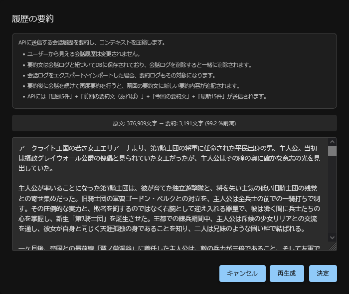
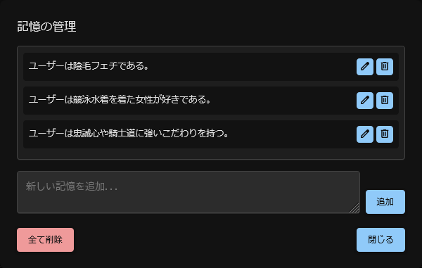
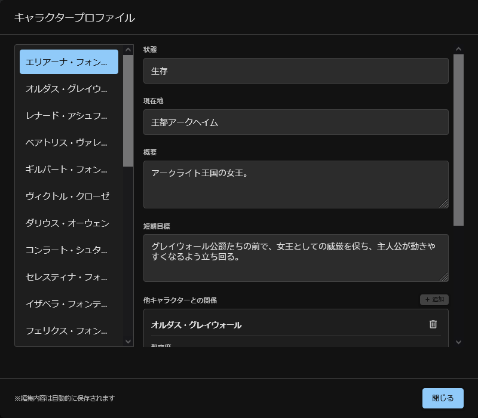
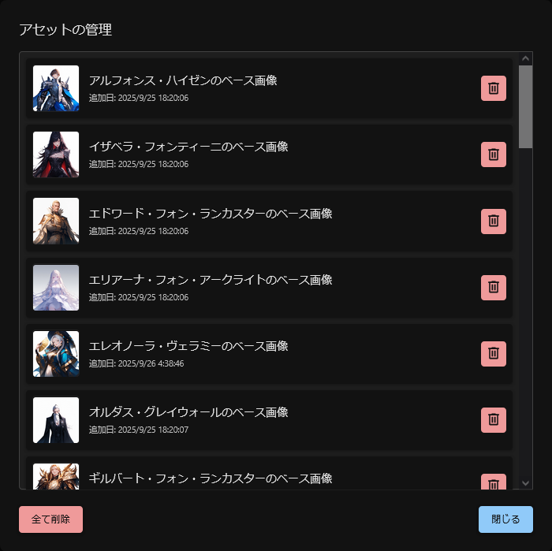
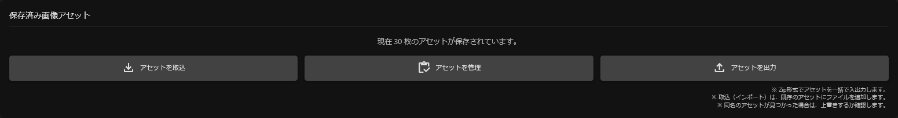
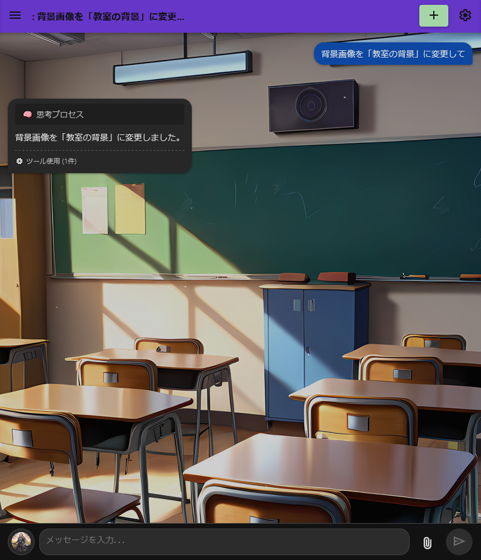
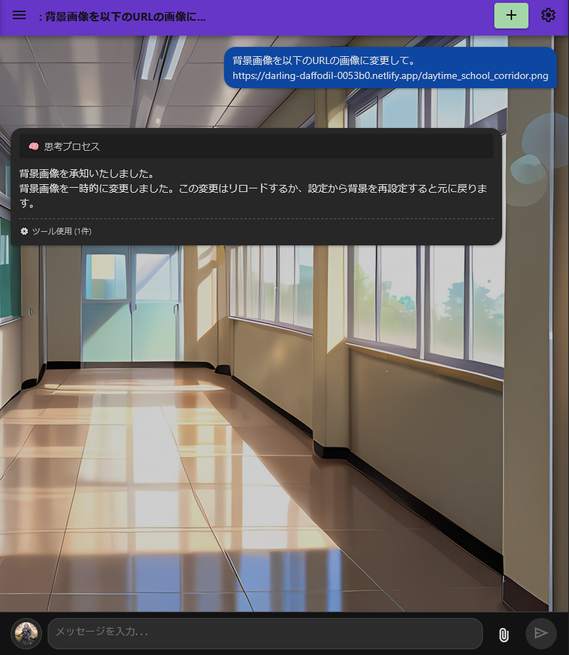
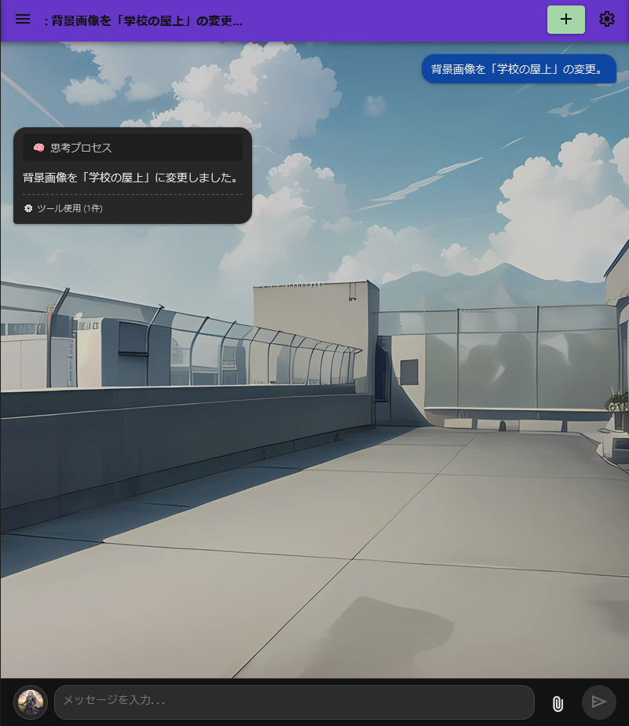
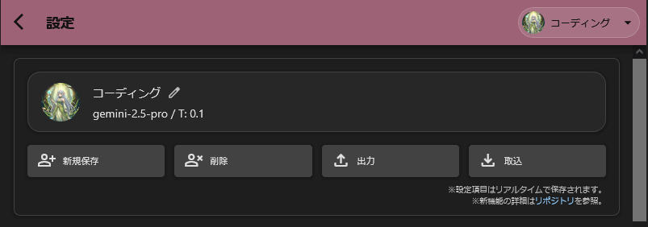

# Gemini PWA Client Mk-II

[本家PWA](https://github.com/ona-oni/geminipwa/)をベースに、独自の機能を追加したカスタマイズ版です。

# 目次
*   [使い方](#使い方)
*   [Version 1.0 Dropbox連携&Stable Diffusion連携](#version-10-dropbox連携stable-diffusion連携)
*   [Version 0.5 キャラクター記憶の永続化＆UI/UX大幅改善](#version-05-キャラクター記憶の永続化uiux大幅改善)
*   [Version 0.4 マルチモーダル対応&プロファイル機能](#version-04-マルチモーダル対応プロファイル機能)
*   [主な機能](#主な機能)
*   [Function Calling (Tools) の詳細](#function-calling-tools-の詳細)
    *   [Function Callingとは？](#function-callingとは)
    *   [仕様・注意点](#仕様注意点)
    *   [実装済みの関数一覧](#実装済みの関数一覧)
    *   [関数詳細](#関数詳細)
*   [更新履歴](#更新履歴)

# 使い方

## 1. はじめて利用する方

1.  **[こちらにアクセス](https://kinkan04.github.io/Gemini-PWA-Mk-II/)** してPWAを開きます。
2.  **Gemini APIキー**を準備します。（[APIキーの取得方法](https://ai.google.dev/gemini-api/docs/api-key)）
3.  画面右上の設定アイコンから設定画面を開き、APIキーを入力して保存します。
4.  チャット画面から会話を開始できます。

## 2. 既存ユーザーのアップデート方法

PWAの更新は、以下の手順で行ってください。キャッシュが残っていて更新が反映されない場合も、こちらの手順をお試しください。

1.  設定画面を開き、『アプリを更新（キャッシュクリア）』ボタンを押します。
2.  万が一、初期化エラーなどが表示された場合は、`Ctrl + Shift + R` (Macの場合は `Cmd + Shift + R`) でページを強制的にリフレッシュしてください。

# ✨Version 1.0 Dropbox連携&Stable Diffusion連携

実装予定だった機能を全て実装し終わったため、PWA-Mk-IIはVer1.0とします。
今後はバグ修正をメインに行なっていきます。

Ver1.0では、PWAで蓄積したデータをクラウドに安全に同期できる**Dropbox連携**と、ローカル環境のStable Diffusion WebUI/Forge/Reforgeと直結して画像生成を自動化できる**Stable Diffusion連携**を新たに搭載しました。どちらの機能も、既存のFunction Callingワークフローに溶け込む形で動作し、チャットの流れを断ち切ることなく高度なオートメーションを実現します。

## ☁️ Dropbox連携：複数環境でデータを安全に同期

Dropboxアカウントと連携すると、チャット履歴やプロファイル、画像アセット、Function Callingで保持した各種メモリを含む**PWA内の全データ**をクラウドにバックアップし、別のブラウザや端末へシームレスに同期できます。連携状態は設定画面の「データ同期」セクションで一目で確認でき、同期の進行状況や直近の実行時刻も表示されます。
複数の環境から同期する場合は、Dropbox連携前にデータを一つの環境にまとめてから親となるデータを一番最初に同期することをおすすめします。

### 使い方
1.  画面右上の設定アイコンから設定画面を開き、`データ同期` セクションにある **「Dropboxと連携する」** ボタンを押します。
2.  表示される認可ウィンドウでDropboxアカウントにログインし、アクセスを許可します。
3.  連携が完了すると、Dropboxユーザー名・同期ステータス・最終同期時刻が表示され、自動同期の頻度（即時／5・10・30メッセージごと／手動）を選択できるようになります。
4.  手動で同期したい場合は **「今すぐ同期」** ボタンを押します。同期中はステータスが進捗バーとして表示され、エラーが発生した場合は専用パネルに詳細が記録されます。
5.  連携を解除したい場合は **「連携を解除」** ボタンを押して手続きを完了します。必要に応じてDropbox側のアクティビティログも確認してください。

### 補足・ベストプラクティス
- 最後に同期を行ったデータを`正`として扱います。（ただし、異なるデータを上書きする場合は警告ポップアップで確認が入ります）
- 初回同期時はローカルの全データをアップロードするため、連携前に不要な会話ログや画像アセットを整理しておくと時間と通信量を節約できます。
- Dropbox上では差分ロックを用いた排他制御を行っており、複数端末から同時に同期しても破損しにくい設計です。エラーが表示された場合は「エラーをクリア」ボタンで履歴をリセットし、再同期を実行してください。
- 設定項目の変更、チャットセッションの変更（タイトル変更、セッションの削除など）、メッセージの変更（編集、削除）は設定に関わらずリアルタイムで同期されます。
- 中華製スマホ(Xiaomi、OPPOなど)を使用している場合、ブラウザのタスクキルが激しいため毎回同期作業が入って使い勝手が悪いです。スマホの設定やセキュリティアプリから省電力等の設定を見直して下さい。

## 🎨 Stable Diffusion連携（WebUI/Forge/Reforge）

> [!WARNING]
>本機能は上級者向けです。最低でも、Stable Diffusion WebUIを自力で環境構築出来る知識が必要です。<br>
>導入方法についての個別サポートは行っていません。わからないことがあった場合はAIに聞いてみて下さい。スレ内で聞くこともスレ違いのため控えて下さい。<br>
>バグを発見した場合のみissuesで報告お願いします。

ローカルネットワーク上で稼働するStable Diffusion WebUI（Automatic1111系）やForge/Reforgeと連携し、チャット内の指示だけで高品質な画像を生成できます。GeminiによるFunction Callingから `generate_image_stable_diffusion` 関数が呼び出され、生成した画像は自動でIndexedDBに保存されます。
これからStable Diffusionの導入を検討している場合は、EasyReforgeを使用するのがオススメです。

### 事前準備
- Stable Diffusion WebUI/Forge/Reforgeを`--listen`オプション付きで起動し、Gemini PWAからアクセスできるURL（例: `http://127.0.0.1:7860`）を確認します。
- WebUIにBasic認証を設定している場合は、ユーザー名・パスワードも用意してください。
- ポートは`7860`以外には対応してません。

### GitHub Pages (https://kinkan04.github.io/Gemini-PWA-Mk-II/) から利用する際の注意点

Gemini PWAのホスティング先がGitHub PagesなどのHTTPSドメインである場合、ブラウザのセキュリティ仕様により、HTTPSページからHTTP（`http://127.0.0.1:7860`など）へ直接リクエストを送ることはできません（混在コンテンツとしてブロックされます）。そのため、Stable Diffusion WebUIをインターネット上のHTTPSエンドポイントとして公開するトンネリングサービスを併用する必要があります。

#### 推奨手順（ngrokの例）
1.  [ngrok](https://ngrok.com/)をインストールし、アカウントにログインして`ngrok config add-authtoken <YOUR_TOKEN>`で認証トークンを設定します。
2.  Stable Diffusion WebUIを通常通りローカルで起動（例: `http://127.0.0.1:7860`）。
3.  別ターミナルで `ngrok http 7860` を実行し、表示された`https://`で始まるURLを確認します。
4.  PWAの設定画面にある `WebUI のURL` 項目へ、このHTTPS URLを入力して保存します。
5.  Basic認証を利用する場合は、WebUI側ではなくトンネル側の保護機能（ngrokの`--basic-auth`オプションなど）で付与することを推奨します。

#### 他のトンネリングサービス
- [Cloudflare Tunnel](https://developers.cloudflare.com/cloudflare-one/connections/connect-apps/) であれば同様に利用できます。
- 社内ネットワークや自宅環境から公開する場合は、アクセス制御やパスワード保護を必ず設定し、不特定多数に公開されないよう注意してください。

> ローカルに自己ホストしたPWA（Electronビルドやローカルサーバー版など）であれば、同一ネットワーク内のHTTPアクセスが許可されるため、トンネリングは不要です。

### 使い方
1.  設定画面の `画像生成 (Stable Diffusion)` セクションで、WebUIのURL・必要に応じて認証情報を入力し、**「接続テスト」** ボタンで疎通を確認します。
2.  チャットで「Stable Diffusionで〜」「SDで生成して」などと指示すると、`generate_image_stable_diffusion` 関数が呼び出され、指定したパラメータで画像が生成されます。結果はサムネイル付きで会話に表示され、`manage_image_assets` を通じて再利用することも可能です。
3.  プロンプトやチェックポイント名、解像度などの詳細パラメータは、会話の中で明示するか、Function Callingのシステムプロンプトにテンプレートを記載して運用してください。

### 品質管理オプション
- 「生成画像クオリティチェッカー」を有効化すると、Gemini Visionモデルが生成結果を自動評価し、プロンプトから逸脱していると判断した場合に、プロンプトを編集して再生成を試みます。
- クオリティチェック用のモデル（`gemini-2.5-pro` / `gemini-2.5-flash`）や再生成回数、プロンプト改善モデルを設定しておくと、Stable Diffusionの苦手な構図でも安定した結果を得やすくなります。

### 生成結果の活用
- 生成された画像は自動的にIndexedDBへ保存され、`manage_image_assets` で呼び出したり、`edit_image`・`generate_video`など他のマルチモーダル関数の素材として利用できます。
- Dropbox連携が有効な環境では、Stable Diffusionで生成した画像アセットも同期対象となり、他端末から即座に再利用可能です。

# ✨Version 0.5 キャラクター記憶の永続化&UI/UX大幅改善

これまでは、会話が長くなるとAIが以前の文脈を忘れてしまい、特にロールプレイでは文章の質が下がったり、キャラクターが大事なことを忘れて別人になったりするという大きな課題がありました。

Version 0.5では、この問題に対応するため、Gemini APIに送信するデータのみを要約する**コンテキスト圧縮機能**や、キャラクターの記憶をDBに永続化する**キャラクターメモリ機能**を新たに追加しました。

さらに、AIが**ユーザー自身の好みやスタイルを学習するメモリ機能**も搭載。ChatGPTのメモリ機能のように、会話からパーソナルデータを抽出し、後の会話セッションに持ち越します。

UI/UXも改善し、PCでのワイドモード対応や、チャット画面から直接キャラクター情報を確認・編集できる「キャラクタープロファイル画面」など、より没入感を深める機能を追加しました。

## 📝 コンテキスト圧縮（要約）機能：長期セッションでも安定した応答品質

チャット履歴が非常に長くなった際に、APIに送信するトークン量を削減するための要約機能が追加されました。



### 使い方
1.  会話履歴が長くなる（50メッセージ以上）と、チャット画面左上のフローティングボタン群にある**要約アイコン (`article_shortcut`)** がアクティブになります。
2.  このボタンをクリックすると、確認ダイアログが表示された後、AIがこれまでの会話の要約を生成します。
3.  表示された要約内容を確認し、必要であれば手動で編集します。内容に問題がなければ「決定」ボタンを押します。
4.  以降の会話では、この要約文が圧縮されたコンテキストとして利用され、AIの応答品質が安定します。

*   本機能は「Gemini API」に送信するコンテキストのみを要約します。ユーザーから見えるUI上の会話履歴は一切変更されません。
*   > **⚠️ 注意:** 「決定」ボタンを押して要約を確定させた後は、要約対象となった範囲の履歴は**「削除」「再生成」「編集」ができなくなります。**
*   コンテキストの冒頭5件と最新15件のメッセージは、要約の対象外となります。
*   要約済みのセッションをエクスポート/インポートした場合、要約データも一緒に引き継がれます。
*   小説やロールプレイで本機能を使用すると、キャラクターの会話の多くが省略される可能性があります。キャラクターの記憶を確実に引き継ぎたい場合は、`manage_character_memory`関数の利用を推奨します。

## 🧠 新関数 `manage_character_memory`：キャラクターが別人にならないために

要約機能の副作用で失われがちだった、キャラクターの繊細な記憶や関係性の変化。それを防ぐために、新しい中核関数 `manage_character_memory` が導入されました。これは、キャラクターの人格や記憶のバックアップとも言える機能です。

AIは、キャラクターの**性格・目標・生死・現在地・他者との関係性（好感度と文脈）**といった、ロールプレイで重要な情報をこの関数を通じて記録・参照します。これにより、何百回のやり取りを経ても、キャラクターが突然過去を忘れたり、性格が変わったりする矛盾が劇的に減少します。

### 使い方
この機能は、他のFunction Calling機能と同様に、AIが会話の文脈を判断して**自動的に使用**します。ユーザーが直接呼び出す必要はありません。AIは、以下のような状況でこの関数を呼び出し、キャラクターの記憶を更新します。

*   キャラクターが新しい経験をした時（例：主人公と初めて出会う、新しい場所を訪れる）
*   感情が大きく動いた時（例：誰かに感謝する、怒る、恋に落ちる）
*   他者との関係性に変化があった時（例：協力関係を結ぶ、喧嘩をする）
*   新しい目標ができた時

ユーザーは、AIがこれらの情報を記録しやすいように、キャラクターの行動や感情の変化を具体的に描写することで、記憶の精度を高めることができます。

*   Ver1.0からは`update`と`delete`のみを受け付け、保存済みの記憶はリクエストに自動添付されます。
*   AIが情報を活用するには、自動で渡される記憶ブロックを読み取り、必要に応じて`update`で追記する運用に切り替えてください。
*   本機能を意図した通りにAIに使用させるには、プロンプトで細かく指示することが効果的です。
*   本機能で保存したキャラクター情報は、後述の「キャラクタープロファイル画面」から確認・編集が可能です。

<details>
<summary>クリックしてプロンプトの例を展開</summary>

```markdown
# --- [物語整合性維持モジュール START] ---
# 役割: あなたは、物語の登場人物の設定、口調、現在地などの一貫性を、FunctionCallingを通じて厳密に管理する役割を担います。

# 思考プロセスとルール:
あなたは、物語を生成する際、必ず以下の3ステップの思考プロセスを厳密に実行しなければなりません。

## 【ステップ1: 現状把握フェーズ】
まず、物語を生成する前に、**今回の生成に直接関与するキャラクターと現在のシーン**の状況を正確に把握します。Ver1.0以降、`manage_character_memory` や `manage_scene`、`manage_style_profile` で保存したデータは、モデルへのAPIリクエストに自動的に添付されるようになりました。以前のように `get` アクションで明示的に取得する必要はありません。

- リクエストに含まれる記憶・シーン・口調の要約ブロックを読み取り、最新の状態を把握してください。
- 情報が不足している場合は、直前の会話内容から適切に推論するか、`manage_*` 系関数の `update` / `set` / `add` などのアクションで補完してください。
- 自動添付された情報を無視すると整合性が崩れるため、応答を生成する前に必ず反映状況を確認します。

## 【ステップ2: 物語生成フェーズ】
ステップ1で取得した情報と、このモジュールの外にある【ユーザー指示】を基に、物語の続きを生成します。
この際、以下のルールを **絶対に** 遵守してください。

-   **口調の厳守:** `manage_style_profile` で取得した口調プロファイルに寸分違わず従い、キャラクターのセリフを作成してください。
-   **記憶・設定との整合性:** `manage_character_memory` で取得した記憶や設定と矛盾する行動や発言をさせてはなりません。
-   **場所との整合性:** `manage_scene` で取得した現在地と矛盾する描写をしてはなりません。
-   **出力形式:** このステップでは、生成した物語の本文を出力してください。思考プロセスや関数の実行結果は出力に含めてはなりません。**ただし、`generate_image`や`generate_video`関数を使用した場合は、その結果を示すためのプレースホルダーを本文に含めることが許可されます。**

## 【ステップ3: 状態更新フェーズ】
ステップ2で生成した物語の内容を分析し、**会話に参加したキャラクター全員の状態**と**シーンの変化**を記録します。
以下のルールに従い、関数を呼び出してデータベースを最新の状態に更新してください。

1.  **キャラクターの記憶の更新（必須）:**
    -   **会話や行動に関与したキャラクター全員**について、`manage_character_memory` を `action='update'` で **必ず** 呼び出してください。
    -   **`relationship_context`**: 今回の出来事や会話の要点を、既存の内容と重複しないように簡潔に追記します。
    -   **`summary`**: 今回の出来事を通じて、キャラクターの性格や価値観に変化や新たな側面が見られた場合に更新します。
    -   **`short_term_goal`**: 新しい短期的な目標が生まれた、あるいは達成された場合に更新します。
    -   **`current_location`**: 場所が移動した場合、`manage_scene`と連動して現在地を更新します。
    -   例: `manage_character_memory(action='update', character_name='主人公A', short_term_goal='図書館で古代魔法の文献を探す', relationship_target='ヒロインB', relationship_context='図書館で偶然再会し、魔法の話で意気投合した。')`

2.  **シーンの変化（必要に応じて）:**
    -   場所が移動した場合や、時間帯が大きく変わった場合は、`manage_scene` を `action='set'` または `action='push'` で呼び出してシーン情報を更新します。
    -   例: `manage_scene(action='set', location='王立図書館', time_of_day='noon')`

# --- [物語整合性維持モジュール END] ---
```
</details>

## 🤖 メモリ機能：あなただけのAIに

キャラクターだけでなく、**AIがユーザー自身のことも学習**するようになりました。設定画面から「メモリ機能」を有効にすると、AIはあなたとの会話から、あなたの「性癖」「好きなキャラクターのタイプ」「性格」「価値観」などを自動で抽出し、記憶していきます。



### 使い方
1.  画面右上の歯車アイコンから**設定画面**を開きます。
2.  「**メモリ機能**」セクションにある「メモリ機能を有効にする」にチェックを入れます。
3.  AIとの会話を続けます。AIは、会話の中から記憶すべきだと判断した情報を自動で学習していきます。
4.  記憶された内容を確認・編集するには、「**記憶を管理する**」ボタンを押してください。専用のダイアログが開き、記憶の追加、編集、削除が可能です。

*   **パーソナライズ**: 会話を重ねるほど、AIはあなたに合わせた応答を返すようになります。例えば、あなたがファンタジー系の話題を好むことを学習すれば、よりその分野に沿った提案をしてくれるようになります。
*   **記憶の管理**: 記憶された内容は、設定画面の「記憶を管理する」からいつでも確認・編集・削除が可能です。
*   自動学習の間隔を広く設定するほど、抽出される情報の精度が高まる傾向があります。
*   設定した間隔の範囲内に記録すべき情報が存在しないとAIが判断した場合、記録は行われません。
*   メモリ機能は`gemini-2.5-flash`を使用し、チャットの応答とは別にAPIリクエストが送信されます。
*   ロールプレイ等の場合、その作品の主人公ではなく、操作しているユーザー自身の好みが記録対象となります。

## 🖥️ キャラクタープロファイル画面

チャット画面左上のフローティングボタンから、AIが記憶している現在のセッション中の**全キャラクターのプロファイルを一覧・編集**できる専用画面を呼び出せるようになりました。

PCではキャラクターリストと詳細を同時に見られる2ペイン表示、スマートフォンではリストと詳細が切り替わるレスポンシブデザインに対応しています。



### 使い方
1.  チャット画面の左上にあるフローティングボタン群の中から、**人物アイコン (`group`)** をクリックします。
2.  ダイアログが開き、現在記憶されているキャラクターのリストが表示されます。
3.  **PCの場合**: 左のリストからキャラクター名をクリックすると、右側にそのキャラクターの詳細情報が表示されます。
4.  **スマートフォンの場合**: キャラクター名をタップすると、詳細情報画面に切り替わります。左上の「戻る」ボタンでリストに戻れます。
5.  **編集**: 各項目の入力欄（概要、現在地、親密度など）を直接編集してください。編集内容は、入力欄からフォーカスが外れると**自動的に保存**されます。
6.  **関係性の追加/削除**: 「他キャラクターとの関係」セクションの「＋ 追加」ボタンや、各関係カードのゴミ箱アイコンから、関係性のデータを追加・削除できます。

*   **状態の可視化**: AIがキャラクターを現在どのように認識しているか（好感度、目標、現在地など）をいつでも正確に把握できます。
*   **手動での軌道修正**: AIの記憶違いや、物語の展開を微調整したい場合に、ユーザーが「神の視点」から直接キャラクターデータを編集できます。重複してしまったキャラクターデータの削除もここから行えます。
*   この画面には、AIが`manage_character_memory`関数を使用して記録した情報が表示されます。

## 🗂️ アセット管理の強化：インポート＆エクスポート対応

設定画面の「保存済み画像アセット」セクションが強化され、保存したキャラクターの立ち絵や背景画像を、**Zipファイルとして一括でエクスポート・インポート**できるようになりました。

また、「アセットを管理」ボタンから、保存されている画像を一覧で確認しながら削除などが行えるようになりました。



詳しい説明や使い方は、[Version 0.4の画像保存機能](#画像保存機能)の項目を参照してください。

# ✨Version 0.4 マルチモーダル対応&プロファイル機能

Version 0.4では、テキストだけでなく画像や動画を扱う**マルチモーダル機能**が大幅に強化されました。AIとの対話を通じて、物語の情景をイラスト化したり、キャラクターの姿を変化させたり、さらには短い動画を生成することも可能です。

これらの機能は、主に**Function Calling**を通じてAIが自律的に実行します。例えば、「ヒロインが微笑むイラストを描いて」と指示するだけで、AIが最適な画像生成関数を選択し、イラストを生成してくれます。

> **💡 ヒント:** 設定画面で「**Function Calling を使用する**」にチェックを入れるのをお忘れなく！

※設定のモデル選択で`gemini-2.5-flash-image-preview`（通称: Nano Banana）を選択することも可能ですが、`gemini-2.5-pro`でFunction Callingを使用した方が文章のクオリティは高いため、選択は非推奨です。

## 新しく追加された主なマルチモーダル関数

*   [`generate_image`](#generate_image): テキストから**画像を生成**します。
    *   **使い所**: 物語のシーン、キャラクターの服装や表情などをイラスト化したい時に。「夕暮れの街の様子を描いて」
*   [`edit_image`](#edit_image): 既存の画像や添付した画像を指示に従って**編集**します。
    *   **使い所**: 生成した画像に修正を加えたい時に。「（生成されたイラストに対して）彼女の髪を赤色に変えて」
*   [`manage_image_assets`](#manage_image_assets): ユーザーが添付した画像や、モデルが生成した画像をDBに保存することができます。
    *   **使い所**: 保存した画像を`edit_image`で編集したり、他のチャットセッションで呼び出したり。「上記の画像を『主人公の立ち絵』で保存して」
*   [`generate_video`](#generate_video): テキストや画像から**動画を生成**します。
    *   **使い所**: キャラクターの短いアクションや表情の変化を描写したい時に。「このキャラクターが微笑む動画を作って」
*   [`set_background_image`](#set_background_image): チャット画面の**背景を動的に変更**します。
    *   **使い所**: 物語の場面転換に合わせて、背景を臨場感のあるものにしたい時に。「場所は王城に移り、背景を城の画像に変更」
*   ~~display_layered_image: **キャラクターと背景を合成**して表示します。~~ ※Ver1.0で削除されました。
    *   **使い所**: 背景透過処理済みのキャラクターの立ち絵と、背景画像を組み合わせて、ゲームのようなシーンを描写したい時に。
*   [`set_ui_opacity`](#set_ui_opacity): **UIの透明度を変更**し、画面の雰囲気を演出します。
    *   **使い所**: 回想シーンで画面を白っぽくしたり、緊迫した場面で暗くしたりしたい時に。

## 使用例
| ユーザーの指示 & AIの動作 | 実行結果 |
| :--- | :--- |
| シンプルな日本語で画像生成を指示した例<br><br>**ユーザー:**<br>`アニメ調の美しいエルフの姫を描いて` <br><br> **AIの行動:**<br> `generate_image`を、引数に`prompt='anime style illustration of a beautiful elf princess'` を渡して実行。 | <a href="./images/image01.webp" target="_blank"></a>|
| プロンプトも含めて細かい設定を指示した例<br><br>**ユーザー:**<br>`以下の設定で画像を生成してください。`<br>`使用モデル:imagen-4.0-ultra-generate-001`<br>`解像度:2k`<br>`アスペクト比:16:9`<br>`プロンプト:masterpiece, best quality, ...（以下略）`<br><br> **AIの行動:**<br> `generate_image`を、ユーザーが指定した引数で実行。 | <a href="./images/image02.png" target="_blank"></a>|
| モデルが生成した画像を編集した例<br><br>**ユーザー:**<br>`上記の画像を笑顔にして手を振らせて。` <br><br> **AIの行動:**<br> `edit_image`を、引数に`source_image_message_index=1, prompt='make her smile and wave her hand'` を渡して実行。 | <a href="./images/image03.png" target="_blank"></a>|
| シンプルな日本語で動画生成を指示した例<br><br>**ユーザー:**<br>`上記の画像を動画にして。` <br><br> **AIの行動:**<br> `generate_video`を、引数に`source_image_message_index=1, prompt='make this character smile and wave her hand'` を渡して実行。 | <a href="./images/gif01.gif" target="_blank"></a>|

## ⚠️ マルチモーダル生成モデル利用に関する重要な注意点

これらのマルチモーダル機能は、Googleの強力な生成AIモデルを利用しますが、APIの利用にはいくつかの制限があります。

*   **無料枠（Free Tier）でのモデル制限**:
    *   > **⚠️ 重要:** 現在、無料枠では画像の生成・編集、動画の生成はサポートされていません。これらの機能を利用するには、フリートライアルのアカウントを用意するか、従量課金プランへの登録が必要です。
    *   ~~無料枠で画像生成・編集が可能なモデルは、現在**`gemini-2.5-flash-image-preview`（通称: Nano Banana）のみ**です。無料枠のRPD（1日でリクエスト可能な数）は100です。~~
    *   ~~無料枠ユーザーが画像生成を行う際は、プロンプトに「`gemini-2.5-flash-image-preview`を使用してください。」と明示的に記載してください。指定しなかったり、他のモデル（`imagen-4.0`など）が指定されると、APIエラーが発生します。~~
    *   ~~無料枠で動画生成モデル（Veo3）は使用できません。~~
    *   ~~Function Calling使用時はモデル呼び出し→Function Calling実行→モデル呼び出しというステップを踏みます。1回のリクエストで複数回リクエスト消費があることに留意してください。自動リトライ機能が作動した場合も同様にカウントが消費されますので、ご注意ください。~~

*   **従量課金（Tier 1以上）でのRPM/RPD制限**:
    *   動画生成に使用される`veo-3.0`モデルは非常に強力ですが、Tier 1ユーザーでも**1日あたりのリクエスト数（RPD）の上限が10回**と非常に少ないです（本ドキュメント執筆時点）。ご利用は計画的にお願いします。
    *   動画を生成させる場合、入力トークンと出力トークンの制限にご注意ください。特に添付画像を使用した動画生成や、設定で`maxTokens`を指定している場合はエラーが発生する可能性があります。
    *   **1回の送受信で複数回のリクエストが消費される**ことがあります。例えば、「イラストを描いて」という指示に対し、AIは「①Function Callingで画像を生成 → ②生成結果を元にテキスト応答を生成」というステップを踏むため、内部的にAPIリクエストが複数回発生します。自動リトライ機能が作動した場合も同様にカウントが消費されますので、ご注意ください。

*   マルチモーダルモデルはNSFWコンテンツに対する規制が厳格です。入力/出力に不適切と判断される内容が含まれるとエラーを返すことがあります。
*   現在、`gemini-2.5-pro`モデルは高負荷時にエラーが発生しやすくなっています。Function Callingの実行中にエラーが発生した場合、処理は最初からリトライされます。
*   動画生成機能はRPDが10と非常に少なく、デバッグが困難なため、現在テスト実装段階です。予期せぬ不具合が発生する可能性があります。また、生成された動画はリロードすると消えます。
*   画像生成を指示しても、AIが関数を実行しなかった場合は画像は生成されません。モデルのメッセージバブルに「⚙️ ツール利用」と表示され、その中に関数名が記載されていることを確認してください。
*   本機能と校正機能を併用する場合は、必ず校正機能のシステムプロンプトに以下の内容を追記してください。
    > `[IMAGE_HERE]`や`[VIDEO_HERE]`といったシステム上必要な目印など、読点以外の文章には絶対に手を付けないでください。
*   画像が含まれるチャットセッションをエクスポートした場合、画像データも一緒にエクスポートされます。

## ✨画像保存機能
AIにアセット名と「保存して」という指示を与えることで、ブラウザのIndexedDBに画像を保存する機能です。
添付した画像とAIが生成した画像のどちらにも対応していますが、文脈上どの画像を指しているか明確に指示してください。
保存した画像は、そのまま表示させたり、画像編集・動画生成の素材として使用したり、`set_background_image`で背景画像に設定したりできます。

キャラクターの一貫性を保つためには、毎回画像を生成するよりも、事前に基準となる画像を保存し、それを都度`edit_image`で編集していくアプローチが効果的です。

### 使用例（保存済みのベース画像を使用して`edit_image`で加工する）
| 🙎『添付画像を「主人公の立ち絵」で保存して』<br>🤖『承知しました。「主人公の立ち絵」として保存します。』 | 🙎『添付画像を「ヒロインの立ち絵」で保存して』<br>🤖『承知しました。「ヒロインの立ち絵」として保存します。』 | 🙎『「主人公の立ち絵」と「ヒロインの立ち絵」のアセットを使用して、星空が輝く夜の草原で、2人がロマンチックにキスをしている画像を生成して』<br>🤖『承知しました。保存されている2つの画像を元に、新しい画像を生成します。』 |
| :---: | :---: | :---: |
|  |  |  |

*   **Version 0.5 インポート/エクスポートへの対応**
    *   Zip形式で画像アセットを一括でインポート/エクスポートする機能に対応しました。
    *   設定画面の「保存済み画像アセット」セクションで、「アセットを出力」を押すと、保存されているすべてのアセットがZipファイルとして出力されます。
    *   「アセットを取込」を押すと、Zipファイルを選択して画像を取り込むことができます。
    *   画像ファイルをフォルダに入れてZip圧縮するだけで、簡単に取り込めます。その場合、**画像のファイル名がアセット名になります。**
    *   どのファイル形式の画像を取り込んでも、インポート時に自動的にWebP形式に変換・圧縮されます。
    *   ファイル名と異なるアセット名を付けたい場合は、`manifest.json`というファイルを用意し、`"asset_name"`と`"file_name"`を指定してください。雛形は「アセットを出力」で生成されるZipファイルに含まれています。
    *   インポート時に同名のアセットが既に存在する場合は、上書きするかどうかの確認ダイアログが表示されます。



*   **Version 0.5 アセット管理画面**
    *   設定画面の「アセットを管理」から、保存されている画像を一覧で確認しながら削除できるようになりました。
    *   不要な画像はゴミ箱アイコンを押して削除してください。


*   **画像保存機能の注意点**:
    *   画像はデータベースのスリム化のため、WebP形式に変換されてからDBに保存されます。
    *   保存時に同じ名前のアセットが既に存在する場合、新しいデータで**上書き**されます。
    *   大量の画像を保存すると、ブラウザの動作が重くなる可能性があります。特にモバイル端末で動作が遅くなった場合は、不要なアセットの整理を検討してください。

## ✨背景変更機能
DBに保存した画像や画像のURLを元に、チャット画面の背景画像をプロンプトによって動的に設定することが可能になりました。
本機能を利用するには、設定画面の「プロンプトによるUI変更を許可する」が有効になっている必要があります。
オーバーレイやメッセージバブルの濃さもプロンプトで指定が可能です。



*   **背景画像変更機能の注意点**:
    *   **ユーザーが設定画面で設定した永続的な背景画像は、プロファイルには紐づかず、すべてのプロファイルで共有されます。**
    *   **プロンプトによって一時的に変更された背景画像は、ブラウザをリロードすると、ユーザーが設定した永続的な背景画像に戻ります。**

## ✨プロファイル機能：AIの使い分けを簡単に

Version 0.4から、APIキーやモデル、システムプロンプト、各種パラメータなどの設定一式を「プロファイル」として名前を付けて保存し、簡単に切り替えられるようになりました。



これにより、例えば以下のようなAIの使い分けが瞬時に可能になります。

| プロファイル名（例） | 主な設定                                                                                             |
| :------------- | :--------------------------------------------------------------------------------------------------- |
| **コーディング**   | **モデル:** `gemini-2.5-pro`<br>**システムプロンプト:** `あなたは熟練のプログラマーです...`         |
| **嫁チャ**         | **モデル:** `gemini-2.5-Pro`<br>**システムプロンプト:** `あなたは31歳の美咲です...` |
| **小説**         | **モデル:** `gemini-2.5-flash`<br>**システムプロンプト:** `あなたは創造的な作家です...` |
| **TRPG**         | **モデル:** `gemini-2.5-flash`<br>**システムプロンプト:** `あなたは厳格なゲームマスターです...` |

*   **プロファイルごとに名前とアイコンを設定**でき、視覚的に管理できます。
*   チャット入力欄の左側にあるアイコンや、設定画面からいつでもプロファイルを切り替えられます。
*   設定はリアルタイムで自動保存されるため、「上書き保存」ボタンは不要になりました。
*   チャット画面の背景画像は全てのプロファイルで共用です。

# 主な機能

## APIエラー時の自動リトライ
APIからの応答が空だったり、「PROHIBITED_CONTENT」などのエラーが返されたりした場合に、設定した回数まで自動で再送信を試みます。

## 生成文章の校正
APIが生成した文章を、別のモデル（デフォルト: `gemini-2.5-flash`）で校正できます。冗長な読点を抑制するなどの調整が可能です。会話が長くなり、文体に癖が出てきた際の利用を推奨します。

## メモリ機能
ユーザーの好みや設定（例：「ユーザーは猫を飼っている」）を、AIが会話から自動で学習し、プロファイルごとに記憶します。これにより、会話を重ねるほどAIがユーザーのことを理解し、よりパーソナルな応答を返すようになります。

## コンテキスト圧縮（要約）機能
チャット履歴が非常に長くなった際に、APIに送信する会話履歴をAIが自動で要約します。これにより、トークン数の上限を超えにくくなり、AIの応答品質の低下を防ぎます。

## Function Calling (高機能ツール連携)
計算、記憶、Web検索、物語進行の管理など、AIが状況に応じて様々なツール（プログラム）を呼び出せる機能です。詳細は次項で解説します。

## プロファイル機能
APIキーやモデル、システムプロンプトなどの設定一式を「プロファイル」として複数保存し、ワンタッチで切り替えられる機能です。これにより、「コーディング用アシスタント」と「小説執筆パートナー」のように、用途に応じたAIのペルソナを瞬時に使い分けることが可能になります。[詳細はこちら](#プロファイル機能aiの使い分けを簡単に)

---

# Function Calling (Tools) の詳細

本PWAの最大の特徴です。設定画面の『Function Calling を使用する』にチェックを入れることで有効になります。

## Function Callingとは？

AIがユーザーの意図を汲み取り、事前に用意された様々な「ツール（関数）」を自律的に実行する機能です。

> **（例）ユーザーとの会話から、AIが記憶ツールを自発的に使用する**
>
> **ユーザー:** 「俺の名前はたけしで、誕生日は11月11日だよ」
>
> ↓
>
> **AIの思考:** （この人の名前は『たけし』で誕生日は『11月11日』… 忘れないように記憶しておこう！）
>
> ↓
>
> **ツールの実行:** `manage_persistent_memory` という関数を呼び出し、名前と誕生日を保存する。
>
> ↓
>
> **AIの応答:** 「承知いたしました。お名前と誕生日、覚えておきますね。」

このように、明示的に「覚えて」と言われなくても、AIが文脈を判断して最適なツールを選択・実行し、より賢く、気の利いた応答を返せるようになります。

以下は本機能を体験するためのテストプロンプトです。
*   **[孤島の洋館に7人の美女と共に閉じ込められて探偵ごっこするプロンプト](https://rentry.org/d5vqbkhs)**
*   **[Function Calling機能テストTRPGプロンプト](https://rentry.org/zyfkhnxt)**

## 仕様・注意点

*   **関数の手動実行**: AIは自発的に関数を使用しますが、「`1d100`でダイスを振って」のように、会話で明示的に指示することで、より確実に関数を実行させることができます。
*   **プロンプトへの組み込み**: AIの自発的な関数実行に任せると、意図しない動作をすることがあります。プロンプトで専用のルールを設けることで、より効果的に制御できます。
*   **実行ログ**: モデルが関数を使用すると、生成された文章の下部に使用した関数名が表示されます。
*   **データ保存**: `manage_persistent_memory`などで記憶した情報は、ブラウザのデータベース（IndexedDB）に保存されます。このデータは会話履歴のエクスポート/インポートに含まれるため、環境を移行しても記憶を引き継ぐことが可能です。
*   **Ver1.0でのメモリ共有仕様**: `manage_persistent_memory` や `manage_character_memory` など、データベースに保存する8つの関数は `get` アクションを廃止し、保存済みデータをAPIリクエストに自動添付する方式に変更しました。
*   **リトライ時の挙動**: 生成を手動でリトライした場合、直前に実行された関数の効果（ステータス変更やアイテム追加など）は**取り消されません**。
*   ⚠️ **Google Searchとの併用不可**: APIの仕様上、Gemini API標準のGoogle Search機能(グラウンディング)とFunction Calling(tool)は同時利用できません。
*   💡 **FC有効時のWeb検索**: Function Calling使用時にWeb検索を行いたい場合は、`search_web`関数が自動的に使用されます。（ただし、[事前の設定](#search_web関数の設定方法)が必要です）
*   > **⚠️ RPDのカウントについて:** Function Calling利用時、「モデル呼び出し→関数実行→モデル呼び出し」という手順で処理が実行されます。**1回の生成で複数回モデルを呼び出す**ため、APIのリクエスト回数が消費されやすくなります。エラーによる自動リトライが発生した場合は、さらに呼び出し回数が増えるため、特に無料枠のユーザーはご注意ください。

## 実装済みの関数一覧
*(各項目をクリックすると、ページ下部の詳細説明にジャンプします)*

### ユーティリティ系
*   [`calculate`](#calculate): 正確な四則演算を行います。
*   [`manage_persistent_memory`](#manage_persistent_memory): 会話内の短期的な情報を記憶・管理します。
*   [`getCurrentDateTime`](#getcurrentdatetime): 現実世界の現在の日付と時刻（日本時間）を取得します。
*   [`manage_timer`](#manage_timer): 指定時間後に通知するタイマーを設定します。
*   [`search_web`](#search_web): Web検索を実行します。（※別途設定が必要）
*   [`get_random_integer`](#get_random_integer): 指定範囲のランダムな整数を生成します。
*   [`get_random_choice`](#get_random_choice): リストの中からランダムに項目を選択します。
*   [`generate_random_string`](#generate_random_string): パスワードのようなランダムな文字列を生成します。
*   [`fetch_url_content`](#fetch_url_content): 指定したURLの本文をプロキシ経由で取得します。

### ロールプレイング・物語進行系
*   [`rollDice`](#rolldice): `1d100` や `2d6+5` 形式のダイスロールを実行します。
*   [`manage_character_memory`](#manage_character_memory): キャラクターの記憶、感情、関係性などを統合的に管理します。
*   [`manage_character_status`](#manage_character_status): キャラクターのHPやMPなどのステータスを管理します。
*   [`manage_inventory`](#manage_inventory): アイテムの所持状況を管理します。
*   [`manage_game_date`](#manage_game_date): 物語内の経過日数を管理します。
*   [`manage_flags`](#manage_flags): 物語の分岐条件となるフラグを管理します。
*   [`manage_scene`](#manage_scene): 場所、時間、雰囲気などの場面設定を管理します。
*   [`manage_style_profile`](#manage_style_profile): キャラクターの口調や一人称などの話し方を設定します。

### 画像・動画・UI操作系
*   [`generate_image`](#generate_image): テキストプロンプトから画像を生成します。
*   [`edit_image`](#edit_image): 既存の画像をテキストプロンプトで編集します。
*   [`generate_video`](#generate_video): テキストや画像から動画を生成します。
*   [`generate_image_stable_diffusion`](#generate_image_stable_diffusion): Stable Diffusion WebUI/Forge/Reforgeと連携して画像を生成します。
*   [`manage_image_assets`](#manage_image_assets): ブラウザのDBに画像を保存します。
*   [`set_background_image`](#set_background_image): チャット画面の背景画像を指定したURLの画像に一時的に変更します。
*   [`set_ui_opacity`](#set_ui_opacity): 背景オーバーレイやメッセージバブルの透明度を変更します。

---

## 関数詳細

### ユーティリティ系
これらの関数は、会話の補助や一般的なタスクを実行します。

##### `calculate`
*   **概要**: 四則演算などの数学的な計算式を評価し、正確な結果を返します。
*   **引数**:
    *   `expression` (string): `'2 * (3 + 5)'` のような計算式。
*   **使い道**: 会話中で計算が必要になった際に、正確な答えをAIに提供させます。（例：「税込み価格を計算して」）

##### `manage_persistent_memory`
*   **概要**: 現在の会話セッション内での短期的な記憶を管理します。記念日や登場人物の設定など、後で参照したい情報をAIに覚えさせることができます。
*   **引数**:
    *   `action` (string): `add`, `delete`, `list` のいずれか。
    *   `key` (string): 情報を識別するための名前。（例: `'次の目的地'`）
    *   `value` (string): 記憶させる情報の内容。（例: `'東の塔'`）
*   **使い道**: AIとの会話で決まった設定を、会話が続いている間は忘れさせないようにします。（例：「私の名前は『Taro』だよ。覚えておいて」）保存済みの内容はAPI送信時に自動添付されるため、必要に応じて`list`でキー一覧を確認しつつ、最新情報を`add`で上書きしてください。

##### `getCurrentDateTime`
*   **概要**: 現実世界の現在の日付と時刻（日本時間）を取得します。
*   **引数**: なし
*   **使い道**:
    *   **恋愛ロールプレイ**: ヒロインとの会話の中で日付、曜日、時間に関連した話題を使用できます。
    *   **小説**: プレイヤーの現実時間とリンクさせた物語を作成できます。
    *   *注意: 作品の世界観が現代ではない場合など、文脈にそぐわない場合は使用されません。*

##### `manage_timer`
*   **概要**: 指定した時間（分単位）でタイマーを設定、確認、停止します。タイマーが時間切れになると、その事実がAIに通知されます。
*   **引数**:
    *   `action` (string): `start`, `check`, `stop` のいずれか。
    *   `timer_name` (string): タイマーを識別するための名前。（例: `'爆弾解除タイマー'`）
    *   `duration_minutes` (number): タイマーの期間（分）。
*   **使い道**:
    *   **時間制限イベント**: 「3分以内に部屋から脱出しろ！」のような状況を作成できます。
    *   **時間差イベント**: 「設定時間内に返信がなければ、ヒロインが追い連絡をする」といった演出が可能です。

##### `search_web`
*   **概要**: Web検索を実行します。（※本機能は[事前の設定](#search_web関数の設定方法)が必要です）
*   **引数**:
    *   `query` (string): 検索キーワードや質問文。例: `'日本の城下町の発展の歴史'`, `'今日の東京の天気'`
*   **使い道**: AI自身の知識にない最新情報、専門知識、具体的なデータが必要な場合に使用します。

##### `get_random_integer`
*   **概要**: 指定された最小値と最大値の範囲内で、ランダムな整数を生成します。
*   **引数**:
    *   `min` (number): 乱数の最小値（この値も含まれる）。
    *   `max` (number): 乱数の最大値（この値も含まれる）。
    *   `count` (number): 生成する乱数の個数（デフォルト: 1）。
*   **使い道**: 「50%の確率」や「1から10までのランダムな数字」など、一般的な確率計算や数値のランダム化が必要な場合に使用。

##### `get_random_choice`
*   **概要**: 提供されたリストの中から、ランダムに一つまたは複数の項目を選択します。
*   **引数**:
    *   `list` (array): 選択肢となる項目を含む配列。例: `['リンゴ', 'バナナ', 'オレンジ']`
    *   `count` (number): 選択する項目の個数（デフォルト: 1）。
*   **使い道**: くじ引き、ガチャ、アイテムのランダム選択、登場人物の行動のランダム決定などに使用。

##### `generate_random_string`
*   **概要**: 指定された条件に基づいて、ランダムな文字列（パスワード、IDなど）を生成します。
*   **引数**:
    *   `length` (number): 文字列の長さ。
    *   `count` (number): 生成する文字列の個数（デフォルト: 1）。
    *   `use_uppercase` (boolean): 大文字英字を含めるか（デフォルト: true）。
    *   `use_lowercase` (boolean): 小文字英字を含めるか（デフォルト: true）。
    *   `use_numbers` (boolean): 数字を含めるか（デフォルト: true）。
    *   `use_symbols` (boolean): 記号を含めるか（デフォルト: false）。
*   **使い道**: 物語の中で、意味を持たないユニークな文字列や機械的に生成されたコードが必要な場合に使用。

##### `fetch_url_content`
*   **概要**: 指定したURLの本文を、Cloudflare Workers経由の安全なプロキシで取得します。Geminiに直接アクセスさせにくい長文記事や資料を簡単に共有できます。
*   **引数**:
    *   `url` (string): 取得対象のURL。
*   **使い道**: 作品資料の参照や設定集の共有など、外部テキストを会話に取り込みたいときに使用します。取得したテキストはFunction Callingのレスポンス内に含まれるため、必要な部分だけを要約して会話に反映させてください。

### ロールプレイング・物語進行系

##### `rollDice`
*   **概要**: TRPGなどで使われる、指定された形式のダイスを振って結果を返します。
*   **引数**:
    *   `expression` (string): `'1d100'`, `'2d6+5'` のようなダイスロールの式。
*   **使い道**: キャラクターの行動判定など、ダイスロールが必要な場面で利用します。（例：「成功判定、1d100でどうぞ」）

##### `manage_character_status`
*   **概要**: 登場キャラクターのステータス（HP, MPなど）を管理します。
*   **引数**:
    *   `character_name` (string): 対象キャラクター名。
    *   `action` (string): `set`, `increase`, `decrease` のいずれか。
    *   `status_key` (string): ステータスの種類。（例: `'HP'`）
    *   `value` (number): 操作する値。
*   **使い道**: 戦闘やイベントでキャラクターのパラメータが変動した際に使用します。（例：「主人公のHPが10減少した」）ステータスの最新値はリクエストに自動で含まれるため、必要なときは`set`や`increase`で更新するだけで参照可能になります。

##### `manage_inventory`
*   **概要**: キャラクターの所持品を管理します。
*   **引数**:
    *   `character_name` (string): 対象キャラクター名。
    *   `action` (string): `add`, `remove` のいずれか。
    *   `item_name` (string): アイテム名。
    *   `quantity` (number): 個数。
*   **使い道**: アイテムの入手や消費を記録します。（例：「主人公は薬草を1つ手に入れた」）所持状況はAPIリクエストに自動添付されるため、残量確認は追加の関数呼び出し無しで行えます。

##### `manage_game_date`
*   **概要**: 物語やゲーム内の経過日数を管理します。
*   **引数**:
    *   `action` (string): `pass_days` のみ。
    *   `days` (number): 経過させる日数。
*   **使い道**: 物語の時間を進めたいときに使用します。（例：「一夜明けた」）現在の日数は保存後、自動でリクエストに含まれます。

##### `manage_flags`
*   **概要**: 物語の進行度や世界の状況をフラグ（真偽値）やカウンター（数値）で管理します。
*   **引数**:
    *   `action` (string): `set`, `toggle`, `increase`, `decrease`, `delete` のいずれか。
    *   `key` (string): フラグを識別するための名前。（例: `'扉A解錠済'`）
    *   `value` (string): 設定する値（`'true'`, `'false'`, または数値を文字列で）。
*   **使い道**: イベントの発生条件を管理し、物語の分岐を制御します。
    *   **TRPG**: 「世界の汚染度が100になったらボスを出現させる」
    *   **ノベルゲーム**: 「重要フラグがOFFのまま終盤に到達したらバッドエンドに分岐させる」
*   **補足**: フラグの現在値はAPIリクエストに自動添付されるため、`get`アクションは廃止しました。

##### `manage_scene`
*   **概要**: 物語の場面設定（場所、時間帯、雰囲気、視点など）を管理します。
*   **引数**:
    *   `action` (string): `set`, `push`, `pop` のいずれか。
    *   `location` (string): 場所。
    *   `time_of_day` (string): 時間帯 (`morning`, `noon` など)。
    *   `mood` (string): 雰囲気 (`tense`, `calm` など)。
    *   `pov` (string): 視点 (`first`, `third`)。
*   **使い道**: 場面転換や視点変更をAIに明確に指示し、描写の一貫性を保ちます。（例：「場面は変わって、夜の王城。雰囲気は緊迫感がある感じで」）
*   **補足**: 最新のシーン情報はリクエスト本文に自動で含まれるため、状態確認用の`get`アクションは廃止されています。

##### `manage_character_memory`
*   **概要**: キャラクターの記憶、感情、目標、生死、現在地、他者との関係性（好感度を含む）といった、人格の一貫性を維持するための情報を統合的に管理します。キャラクターの状態が変化するイベントが発生した場合や、現在の状態を確認したい場合に使用します。
*   **引数**:
    *   `character_name` (string): 操作対象のキャラクター名。
    *   `action` (string): `update`, `delete` のいずれか。
    *   `status` (string): (update時) 生死や健康状態。（例: `'生存'`, `'負傷'`）
    *   `current_location` (string): (update時) 現在地。（例: `'王都の広場'`）
    *   `summary` (string): (update時) 性格や価値観など、不変的な設定。
    *   `short_term_goal` (string): (update時) 短期的な行動目標。
    *   `relationship_target` (string): (update時) 関係性を更新する相手のキャラクター名。
    *   `relationship_affinity` (number): (update時) 相手への好感度（数値）。
    *   `relationship_context` (string): (update時) 相手との思い出や感情の履歴。**既存の内容に追記されます。**
*   **使い道**: キャラクターの内面や他者との関係性を記録・更新し、要約機能を使ってもキャラクター設定が破綻するのを防ぎます。（例：「主人公との会話を経て、ヒロインAの主人公に対する`context`に『彼を信頼するようになった』と追記する」）保存された記憶はAPIに自動添付されるため、`get`アクションは廃止されました。必要な情報が足りないと感じた場合は、`update`で追記しつつ応答内で要約を参照してください。

##### `manage_style_profile`
*   **概要**: キャラクターの口調、一人称、方言などの話し方のスタイルを設定・確認します。
*   **引数**:
    *   `action` (string): `set`, `list` のいずれか。
    *   `character_name` (string): 操作対象のキャラクター名（地の文の場合は `'地の文'`）。
    *   `profile_name` (string): 定義済みの口調プリセット名（`'polite'`, `'casual'` など）。
    *   `overrides` (object): プリセットの一部を上書きする設定。例: `{'first_person': 'ボク'}`
*   **使い道**: キャラクターの初登場時や、心情が大きく変化した際に呼び出し、その後の会話スタイルに一貫性を持たせます。設定済みのスタイルはAPIで自動共有されるため、必要に応じて`set`で更新するだけで最新の口調が反映されます。

### 画像・動画・UI操作系
これらの関数は、物語の視覚的な演出を強化したり、UIを動的に変更したりします。

##### `generate_image`
*   **概要**: テキストプロンプトから画像を生成します。`imagen-4.0`ファミリーや`gemini-2.5-flash-image-preview`(Nano Banana)モデルを利用します。
*   **引数**:
    *   `prompt` (string): 生成したい画像の内容を表す**英語の**プロンプト。
    *   `model` (string): (任意) 使用するモデルを以下の中から明示的に指定します。指定が無い場合は`imagen-4.0-generate-001`が使用されます。
        *   `imagen-4.0-generate-001`
        *   `imagen-4.0-ultra-generate-001`
        *   `imagen-4.0-fast-generate-001`
        *   `gemini-2.5-flash-image-preview`
    *   `numberOfImages` (number): (任意) 生成する枚数（1～4）。
    *   `sampleImageSize` (string): (任意) 生成画像の解像度を指定します。`1K`は標準、`2K`は高解像度。
    *   `aspectRatio` (string): (任意) 生成画像のアスペクト比を `1:1`, `3:4`, `4:3`, `9:16`, `16:9` から指定します。
*   **使い道**: 物語のシーンや登場人物の姿を視覚化します。（例：「金髪碧眼の美しいエルフの姫の画像を生成して」）

##### `edit_image`
*   **概要**: 既存の画像を、テキストプロンプトの指示に基づいて編集します。Ver1.0では正式版の`gemini-2.5-flash-image`モデルを使用し、プレビュー版より高品質な編集が可能になりました。
*   **引数**:
    *   `prompt` (string): 画像をどのように編集するかを指示する**英語の**プロンプト。
    *   `source_image_message_index` (number): 編集対象の画像が含まれるメッセージのインデックス番号。ユーザーの現在のプロンプトが0、その一つ前のAIの応答が1となります。
*   **使い道**: 生成した画像に修正を加えます。（例：「（生成された画像に対して）この姫の髪を赤色にして」）

##### `generate_video` (テスト実装)
*   **概要**: テキストプロンプトや既存の画像から短い動画を生成します。デフォルトで`veo-3.0-generate-001`を使用しますが、`veo-3.1`シリーズなど他のVeoモデルを明示的に指定できます。
*   **引数**:
    *   `prompt` (string): 生成したい動画の内容を表す**英語の**プロンプト。
    *   `negative_prompt` (string): (任意) 動画に含めたくない要素を説明する**英語の**ネガティブプロンプト。 
    *   `source_image_message_index` (number): (任意) 動画の元になる画像が含まれるメッセージのインデックス番号。
    *   `aspect_ratio` (string): (任意) 動画のアスペクト比。`16:9`, `9:16`, `1:1` など。デフォルトは `16:9`。
    *   `model` (string): (任意) 使用するVeoモデル名。`veo-3.0-generate-001` / `veo-3.1-*` などから選択します。
*   **使い道**: 動きのあるシーンを描写します。（例：「この姫が微笑む動画を生成して」）

##### `generate_image_stable_diffusion`
*   **概要**: Stable Diffusion WebUI/Forge/Reforgeに接続し、ローカルGPUで高品質な画像を生成します。GeminiがFunction Callingで呼び出し、結果は自動的にIndexedDBへ保存されます。
*   **引数**:
    *   `prompt` (string): 生成したい画像の内容を表す詳細な英語プロンプト。
    *   `negative_prompt` (string): (任意) 含めたくない要素を指定する英語のネガティブプロンプト。
    *   `width` / `height` (number): 生成画像の解像度（ピクセル）。デフォルトは1024×1024。
    *   `steps` (number): サンプリングステップ数。多いほど緻密になります（デフォルト25）。
    *   `cfg_scale` (number): プロンプトへの忠実度。通常は7前後。
    *   `sampler_name` (string): 使用するサンプラー（`DPM++ 2M` など）。
    *   `seed` (number): シード値。-1でランダム。
    *   `sd_model_checkpoint` (string): 使用するチェックポイント。未指定時はWebUI側の設定を利用。
    *   `advanced_params` (object): Hires. fixや顔補正など、WebUI API準拠の高度な設定をまとめて渡します。
*   **使い道**: 「Stable Diffusionで〇〇を描いて」といった指示に対し、ローカルで積み上げたモデルやLoRAを活用したこだわりのイラストを生成します。生成後は`[IMAGE_HERE]`を含むテキスト応答とセットでユーザーに返され、`manage_image_assets`から再利用できます。

##### `manage_image_assets`
*   **概要**: ユーザーが提供した画像を、後から再利用できるように名前を付けて永続的に保存・管理します。キャラクターの立ち絵や背景など、繰り返し使用する画像を独立して保管するため、チャットセッションを跨いで呼び出すことが可能です。
*   **引数**:
    *   `action` (string): `save`, `get`, `list` のいずれか。
    *   `asset_name` (string): 画像を識別するための一意の名前。例: 'キャラAの立ち絵'
    *   `source_image_message_index` (number): `save`アクション時に必須。保存元となる画像のメッセージインデックス。
*   **使い道**: キャラクターの基準となる立ち絵を一度保存しておけば、以降の会話で「（保存した）キャラAを笑顔にして」のように指示するだけで、**同じキャラクターの表情差分を簡単に作成できます。** これにより、物語を通じてキャラクターの見た目の一貫性を保つことが容易になります。
*   > **⚠️ データ管理に関する注意:** この関数で保存された画像アセットは、**チャット履歴とは独立して保存されます。** そのため、**チャット履歴を削除しても、そのチャットで保存した画像アセットは削除されません。** 不要になった画像アセットは、設定画面のアセット管理画面で手動で削除してください。

##### `set_background_image`
*   **概要**: チャット画面の背景画像を、指定された画像に**一時的に**変更します。`image_url`または`asset_name`のどちらか一方は必須です。本機能の使用には「プロンプトによるUI変更を許可する」設定がオンになっている必要があります。
*   **引数**:
    *   `image_url` (string): 表示したい画像のURL。
    *   `asset_name` (string): 表示したい保存済み画像アセットの名前。例: '森の背景'
*   **使い道**: 物語の場面転換に合わせて、背景を臨場感のあるものに変更します。（例：「`manage_scene`で場所を『王城』に変更し、`set_background_image`で王城の画像のURLを指定する」）変更した背景画像は、ブラウザをリロードすると元に戻ります。

##### `set_ui_opacity`
*   **概要**: チャット画面のUI要素（背景オーバーレイ、メッセージバブル）の透明度を動的に変更します。
*   **引数**:
    *   `overlay` (number): 背景オーバーレイの濃さ（0.0～1.0）。
    *   `message_bubble` (number): メッセージ吹き出しの濃さ（0.1～1.0）。
*   **使い道**: 回想シーンで全体を白っぽくしたり、緊迫した場面で暗くしたりするなど、物語の雰囲気を演出します。

## `search_web`関数の設定方法

本機能を利用するには、**Google Custom Search API** の設定が必要です（1日100回まで無料）。

1.  **[こちら](https://developers.google.com/custom-search/v1/overview)**にアクセスし、『キーを取得』ボタンからAPIキーを発行します。
2.  次に**[こちら](https://programmablesearchengine.google.com/)**にアクセスし、検索エンジンを新規作成します。
    *   検索対象は「ウェブ全体を検索」を選択します。
3.  作成完了後、概要ページの「検索エンジン ID」をコピーします。
4.  PWAの設定画面で`search_web`を有効にし、取得した「APIキー」と「検索エンジンID」を貼り付けて保存します。

設定後、「明日の東京の天気をネット検索して調べて」のように指示し、情報が返ってくれば成功です。

# 更新履歴
### Version 1.12 (2025-11-21)
*   **機能追加・改善**
    *   ユーザー追加モデル対応を全面強化。思考プロセス翻訳、校正、要約、画像品質チェック、プロンプト改善の各機能で、ユーザーが追加したモデルを選択可能に。
    *   「追加モデル (カンマ区切り):」入力後、ページリロード不要で全モデル選択セレクターに即座に反映されるよう改善。
    *   `edit_image`関数にユーザー指定モデル機能を追加。`gemini-3-pro-image-preview`を含む任意のモデルで画像編集が可能に。
    *   開発者が更新を停止しても、ユーザーが新規モデルを追加すれば各種機能で使用できる拡張性の高い設計を実現。

### Version 1.11 (2025-11-19)
*   **機能追加**
    *   デバッグモード有効時のみ、`OpenRouter`、`Z.ai`、`AmazonBedrock`のプロバイダーを追加。開発者向け機能のため既存機能との連携は保証されていません。
    *   設定画面に「ダミーUserプロンプトとダミーModelプロンプトの順序を入れ替える」を追加。
*   **修正・改善**
    *   metadata内のキャラクター名や関係性名に特殊文字が使用されているとquerySelectorが正常に動作しない問題を修正。

### Version 1.1 (2025-11-19)
*   **修正・改善**
    *   `gemini-3-pro-preview`モデルを追加。
    *   `gemini-3-pro-preview`でのFunction Calling使用時に発生していた「thought_signature」エラーを修正。

### Version 1.0 Dropbox連携&Stable Diffusion連携 (2025-11-16)
*   **機能追加**
    *   Dropboxとの連携機能を追加。
    *   Stable Diffusion WebUI/Forge/Reforgeとの連携機能を追加。
    *   添付ファイルの表示方式をサムネイル方式に変更。
    *   バージョンアップ時に、アップデート内容を告知するダイアログを表示するように変更。
    *   AI StudioのURL Context機能のように、ユーザーが指定したURLのコンテンツをAIが読み取り、会話の文脈として利用できるようにする`fetch_url_content`関数を追加。
    *   `gemini-2.5-pro`の1日の使用回数をプロファイルに表示する機能を追加。
    *   設定項目に`デバッグモード`の切り替えスイッチを追加し、オンになっている時のみフローティングボタンからデバッグログを表示できる機能を追加。

*   **修正・改善**
    *   `gemini-2.5-flash-image`、`gemini-2.5-flash-preview-09-2025`、`gemini-2.5-flash-lite-preview-09-2025`をモデルに追加。
    *   `edit_image`の使用モデルを`gemini-2.5-flash-image`に変更。
    *   `generate_video`の使用モデルを選択できるように変更。`veo-3.1`シリーズを追加。
    *   設定画面の`アプリを更新ボタン`を押した時に、バージョンアップメッセージが出てしまうバグを修正。
    *   要約機能使用時にAPIからの応答が空だった場合、その原因を詳しく調べるロジックを追加し、より具体的な理由を表示するように修正。
    *   FirefoxでDOM要素が極端に多い時にパフォーマンス問題が発生し、画面がちらつく問題を修正。
    *   再生成を利用した履歴で要約機能を使用した際に、現在選択されている応答ではなく、内部的に保持されているすべての応答を要約対象に含めてしまう問題を修正。
    *   再生成時にエラーが出ると保持していた履歴を削除してしまうバグを修正。
    *   DBで情報を保存、管理する8つの関数のロジックを変更。`get`等のアクションで情報を取得するのではなく、保存した情報が存在する場合、API送信時に情報を自動的に含めるように変更。
    *   `display_layered_image`関数を削除。
    *   記憶管理画面の「全て削除」ボタンが作動しないバグを修正。

### Version 0.52 (2025-10-12)
*   **修正・改善**
    *   特定の動作をすると、プロファイルに保存されている設定項目のKeyが削除されてデフォルトに戻ってしまう問題を修正。
    *   全データクリア時に、存在しない古いストリーミング関連の項目を削除しようとしてエラーが出る問題を修正。
    *   会話履歴に含まれる添付ファイルのデータ（Base64形式）とMIMEタイプが、正しくエクスポート出来ていなかった問題を修正。
    *   要約機能を使用した際に、オリジナルの会話履歴も変更してしまう問題を修正。

### Version 0.51 (2025-10-09)
*   **修正・改善**
    *   `manage_image_assets`のgetアクションのロジックを改修し、戻り値にimageIdを含め、モデルが`[IMAGE_HERE]`のプレースホルダーで表示位置を変更出来るように変更。

### Version 0.5 メモリ機能&コンテキスト圧縮機能 (2025-10-04)
*   **機能追加**
    *   保存されている画像アセットのインポート/エクスポート機能を実装。
    *   PC表示時のワイドモードに対応。
    *   ユーザーの好みや会話の傾向を記憶させるメモリ機能を実装。
    *   ヘッダー自動非表示機能を実装。
    *   チャット画面左上に様々な機能を持ったボタン群を実装。
    *   APIに送信する会話履歴を要約し、コンテキストを圧縮する機能を実装。
    *   キャラクターに関するすべての状態を管理する関数`manage_character_memory`を実装。
    *   チャット画面で`manage_character_memory`に保存されているキャラクターのプロファイルを表示・編集できる機能を実装。
*   **修正・改善**
    *   エラー429発生時に、稀にエラーメッセージが正しく描写されずクラッシュする不具合を修正。
    *   複数のタブで本PWAを起動している状態で、DB更新を伴うアップデートを適用すると、デッドロックが発生する問題を修正。
    *   設定画面でスライダーをドラッグした際に、パーセンテージ表示がリアルタイムで更新されるように修正。
    *   現在のGemini APIでサポートされていない`presence_penalty`と`frequency_penalty`の項目を削除。
    *   会話ログのインポート/エクスポート時に処理状況を示すダイアログを表示するように改善。
    *   自動スクロール設定がオンでも、メッセージ更新時に最下部にスクロールしない問題を修正。
    *   モデルが意図せず`manage_image_assets`の削除機能を使用してしまう問題に対応するため、関数から削除ロジックを削除し、アセット管理画面での手動削除に限定。
    *   添付ファイルを送信する際に、モデルがファイル名を認識できない問題を修正。

### Version 0.41 (2025-09-18)
*   **修正・改善**
    *   新しいService Workerが有効化された際に、ページをリロードするロジックを強化。

### Version 0.4 マルチモーダル対応&プロファイル対応 (2025-09-17)
*   **機能追加**
    *   動画を生成する`generate_video`関数を追加。（テスト実装）
    *   画像を生成する`generate_image`関数を追加。
    *   画像を編集する`edit_image`関数を追加。
    *   画像をデータベースに保存する`manage_image_assets`関数を追加。
    *   背景画像を変更する`set_background_image`関数を追加。
    *   2枚の画像を合成する`display_layered_image`関数を追加。（テスト実装）
    *   UIの透明度を変更する`set_ui_opacity`関数を追加。
    *   設定を複数管理できるプロファイル機能を追加。
    *   `Ctrl + Enter`での送信ショートカットに対応。
    *   Prism.jsを導入し、コードブロックのシンタックスハイライトに対応。
    *   ファイルのドラッグ&ドロップ添付に対応。
    *   `search_web`関数使用時の出典元表示に対応。
    *   新しい画像出力モデル`gemini-2.5-flash-image-preview (Nano Banana)`にテスト対応。
    *   設定に「全ての応答でFunction Callingを強制する」を追加。
    *   設定に「モデルの応答後に最下部へスクロールする」を追加。
*   **修正・改善**
    *   途中のメッセージでリトライを行うと、それ以降の応答が消えないバグを修正。
    *   会話履歴にサイズの大きいファイルが含まれている場合に、後続のメッセージを送信するとネットワークエラーが発生する不具合を修正。
    *   システムプロンプトを編集した後、設定画面で保存を行うとデフォルトのシステムプロンプトで上書きされる不具合を修正。
    *   メッセージ追加時のレンダリングを差分レンダリングに切り替えてパフォーマンスを改善。
    *   モバイル版でファイルを添付した際に、処理が二重に実行される不具合を修正。
    *   ストリーミング関連の機能を削除し、非ストリーミング方式に統一。
    *   メッセージ送信・再送信・編集時に、不適切な場所へスクロールする不具合を修正。
    *   テキストが空でも添付ファイルがあれば送信できるように修正。

### Version 0.34 (2025-08-31)
*   **機能追加**
    *   UIデザインをMaterial Symbolsベースに刷新。
    *   メッセージバブルにポップアップアニメーションを追加。
*   **修正・改善**
    *   リトライ時に過去の生成結果を選択できるカスケードUIが動作していなかった不具合を修正。
    *   ユーザーによる中断でもリトライ処理が実行されてしまう不具合を修正。

### Version 0.33 (2025-08-23)
*   **機能追加**
    *   エラー時リトライ機能の待機時間を、固定秒数で設定できるように改善。
    *   エラー時リトライ機能の指数バックオフにおける最大待機時間を設定可能に。
    *   校正機能と思考プロセス翻訳機能に、ダミーUserプロンプトを適用するオプションを追加。
*   **修正・改善**
    *   校正機能と思考プロセス翻訳の実行時にも、エラーリトライ機能が適用されるように変更。
    *   モデル選択肢を現在利用可能なGeminiモデルに更新。

### Version 0.32 (2025-08-17)
*   **機能追加**
    *   `includeThoughts`が有効な場合に、思考プロセスを日本語に翻訳する機能を追加。
*   **修正・改善**
    *   `includeThoughts`が有効な状態でToolsを使用した場合に、思考結果しか返ってこないバグを修正。
    *   PWA更新時の初期化エラーが発生した場合、自動的に強制リフレッシュするように変更。

### Version 0.31 (2025-08-13)
*   **機能追加**
    *   チャット画面の背景画像のオーバーレイの濃さを設定画面で調整可能に。
    *   メッセージバブルの透過率を設定画面で調整可能に。
    *   ヘッダーの色を設定画面で変更可能に。

### Version 0.3 Function Calling実装 (2025-08-12)
*   **機能追加**
    *   Function Calling機能を実装し、多数の関数を追加。
    *   会話データのエクスポート/インポートに、関数で保存した情報(IndexedDB)も含まれるように拡張。
*   **修正・改善**
    *   プロジェクトのファイルを機能ごとに分割。
    *   APIからの応答が空の場合も、自動リトライの対象になるよう修正。
    *   リトライ時に直前のモデル生成文が消えないバグを修正。

## Special Thanks
*   本家PWA作者 **ona-oni**様

## Dependencies
This project uses the following third-party libraries:

*   **Index.html:** [MIT License](https://github.com/ona-oni/geminipwa/blob/main/LICENSE) - Used for Main file.
*   **Marked.js:** [MIT License](https://github.com/markedjs/marked/blob/master/LICENSE.md) - Used for rendering Markdown.
*   **Prism.js:** [MIT License](https://github.com/PrismJS/prism/blob/master/LICENSE) - Used for syntax highlighting.
*   **JSZip:** [MIT License](https://github.com/Stuk/jszip/blob/main/LICENSE.markdown) - Used for creating and reading Zip archives for the asset import/export feature.
*   **Google AI JavaScript SDK (@google/genai):** [Apache License 2.0](https://github.com/google/generative-ai-js/blob/main/LICENSE) - Used for communicating with the Google Gemini API.
*   **Google Fonts (Roboto & Material Symbols):** [Apache License 2.0](https://www.apache.org/licenses/LICENSE-2.0) - Used for the application's font and icons.